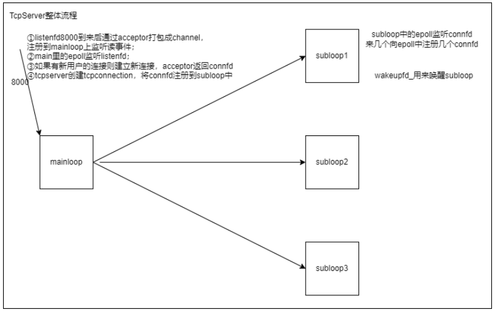

# mymuduo项目架构

## mymuduo介绍

1. 学习陈硕老师的C++ muduo 网络库优秀的代码设计及编程方法；
2. 利用Reactor反应堆模型搭建多线程C++11网络库；
3. 基于事件驱动和事件回调的epoll+线程池面向对象编程；
4. 实现Channel、Poller、EventLoop、TcpServer、TcpConnection等重要部分。


## 环境配置

- ubuntu18.04 远程服务器
- win10 vscode SSH连接
- 安装cmake、g++


## mymuduo库的安装

```
chmod +x autobuild.sh
sudo ./autobuild.sh
```


## 编译测试

```
example文件下
sudo make
./testserver
```


## 项目架构





## Multi-Reactor架构的三大核心模块介绍

### 1.1 概述

Muduo库有三个核心组件支撑一个reactor实现 [**持续**] 的 [**监听**] 一组fd，并根据每个fd上发生的事件 [**调用**] 相应的处理函数。这三个组件分别是`Channel`类、`Poller/EpollPoller`类以及`EventLoop`类。


### 1.2 三大核心模块之一：Channel类 

**1.2.1 Channel类概述：**

**Channel类其实相当于一个文件描述符的保姆！**

在TCP网络编程中，想要IO多路复用监听某个文件描述符，就要把这个fd和该fd感兴趣的事件通过epoll_ctl**注册**到IO多路复用模块（**事件监听器**）上。当事件监听器监听到该fd发生了某个事件。事件监听器返回 [发生事件的fd集合]以及[每个fd都发生了什么事件]

Channel类则封装了一个 [fd] 和这个 [fd感兴趣事件] 以及事件监听器监听到 [该fd实际发生的事件]。同时Channel类还提供了**设置**该fd的感兴趣事件，以及将该fd及其感兴趣事件**注册**到事件监听器或从事件监听器上**移除**，以及**保存**了该fd的每种事件对应的处理函数。


**1.2.2 Channel类重要的成员变量：**

- - `int fd_`这个Channel对象照看的文件描述符
  - `int events_`代表fd感兴趣的事件类型集合
  - `int revents_`代表事件监听器实际监听到该fd发生的事件类型集合，当事件监听器监听到一个fd发生了什么事件，通过`Channel::set_revents()`函数来设置revents值。
  - `EventLoop* loop`这个fd属于哪个EventLoop对象，这个暂时不解释。
  - `read_callback_` 、`write_callback_`、`close_callback_`、`error_callback_`：这些是std::function类型，代表着这个Channel为这个文件描述符保存的各事件类型发生时的处理函数。比如这个fd发生了可读事件，需要执行可读事件处理函数，这时候Channel类都替你保管好了这些可调用函数，真是贴心啊，要用执行的时候直接管保姆要就可以了。

**1.2.3 Channel类重要的成员方法：**

- **向Channel对象注册各类事件的处理函数**

```cpp
void setReadCallback(ReadEventCallback cb) {read_callback_ = std::move(cb);}
void setWriteCallback(Eventcallback cb) {write_callback_ = std::move(cb);}
void setCloseCallback(EventCallback cb) {close_callback_ = std::move(cb);}
void setErrorCallback(EventCallback cb) {error_callback_ = std::move(cb);} 
```

一个文件描述符会发生可读、可写、关闭、错误事件。当发生这些事件后，就需要调用相应的处理函数来处理。外部通过调用上面这四个函数可以将事件处理函数放进Channel类中，当需要调用的时候就可以直接拿出来调用了。

- **将Channel中的文件描述符及其感兴趣事件注册事件监听器上或从事件监听器上移除**

```cpp
void enableReading() {events_ |= kReadEvent; upadte();}
void disableReading() {events_ &= ~kReadEvent; update();}
void enableWriting() {events_ |= kWriteEvent; update();}
void disableWriting() {events_ &= ~kWriteEvent; update();}
void disableAll() {events_ |= kNonEvent; update();}
```

外部通过这几个函数来告知Channel你所监管的文件描述符都对哪些事件类型感兴趣，并把这个文件描述符及其感兴趣事件注册到事件监听器（IO多路复用模块）上。这些函数里面都有一个`update()`私有成员方法，这个update其实本质上就是调用了`epoll_ctl()`。

- `int set_revents(int revt) {revents_ = revt;}`

当事件监听器监听到某个文件描述符发生了什么事件，通过这个函数可以将这个文件描述符实际发生的事件封装进这个Channel中。

- `void HandlerEvent(TimeStamp receive_time)`

当调用`epoll_wait()`后，可以得知事件监听器上哪些Channel（文件描述符）发生了哪些事件，事件发生后自然就要调用这些Channel对应的处理函数。 `Channel::HandleEvent`，让每个发生了事件的Channel调用自己保管的事件处理函数。每个Channel会根据自己文件描述符实际发生的事件（通过Channel中的`revents_`变量得知）和感兴趣的事件（通过Channel中的`events_`变量得知）来选择调用`read_callback_`和/或`write_callback_`和/或`close_callback_`和/或`error_callback_`。


### 1.3 三大核心模块之二：Poller / EpollPoller

**1.3.1 Poller/EpollPoller概述**

**负责监听文件描述符事件是否触发**以及**返回发生事件的文件描述符以及具体事件**的模块就是Poller。所以**一个Poller对象对应一个事件监听器**（这里我不确定要不要把Poller就当作事件监听器）。在multi-reactor模型中，有多少reactor就有多少Poller。

muduo提供了epoll和poll两种IO多路复用方法来实现事件监听。不过默认是使用epoll来实现，也可以通过选项选择poll。但是我自己重构的muduo库只支持epoll。

这个Poller是个抽象虚类，由EpollPoller和PollPoller继承实现，与监听文件描述符和返回监听结果的具体方法也基本上是在这两个派生类中实现。EpollPoller就是封装了用epoll方法实现的与事件监听有关的各种方法，PollPoller就是封装了poll方法实现的与事件监听有关的各种方法。**以后谈到Poller希望大家都知道我说的其实是EpollPoller。**

**1.3.2 Poller/EpollPoller的重要成员变量：**

- - `epollfd_`就是用`epoll_create`方法返回的epoll句柄，这个是常识。
  - `channels_`：这个变量是`std::unordered_map<int, Channel*>`类型，负责记录 文件描述符 ---> Channel的映射，也帮忙保管所有注册在你这个Poller上的Channel。
  - `ownerLoop_`：所属的EventLoop对象，看到后面你懂了。

**1.3.3 EpollPoller给外部提供的最重要的方法：**

```cpp
TimeStamp poll(int timeoutMs, ChannelList *activeChannels)
```

这个函数是**Poller的核心**，当外部调用`poll`方法的时候，该方法底层其实是通过`epoll_wait`获取这个事件监听器上发生事件的fd及其对应发生的事件，我们知道每个fd都是由一个Channel封装的，通过哈希表`channels_`可以根据fd找到封装这个fd的Channel。**将事件监听器监听到该fd发生的事件写进这个Channel中的revents成员变量中。**然后把这个Channel装进`activeChannels`中（它是一个vector<Channel*>）。这样，当外界调用完`poll`之后就能拿到事件监听器的**监听结果（`activeChannels_`）**，【这里标红是因为后面会经常提到这个“监听结果”这四个字，希望你明白这代表什么含义】，这个activeChannels就是事件监听器监听到的发生事件的fd，以及每个fd都发生了什么事件。


### 1.4 三大核心模块之三：EventLoop

**1.4.1 EventLoop概述：**

刚才的Poller是封装了和事件监听有关的方法和成员，调用一次`Poller::poll`方法它就能给你返回事件监听器的监听结果（发生事件的fd 及其 发生的事件）。作为一个网络服务器，需要有持续监听、持续获取监听结果、持续处理监听结果对应的事件的能力，也就是我们需要**循环**的去 【调用`Poller:poll`方法获取实际发生事件的Channel集合，然后调用这些Channel里面保管的不同类型事件的处理函数（调用`Channel::HandlerEvent`方法）。】

EventLoop就是负责实现**“循环”**，负责驱动**“循环”**的重要模块！！Channel和Poller其实相当于EventLoop的手下，EventLoop整合封装了二者并向上提供了更方便的接口来使用。